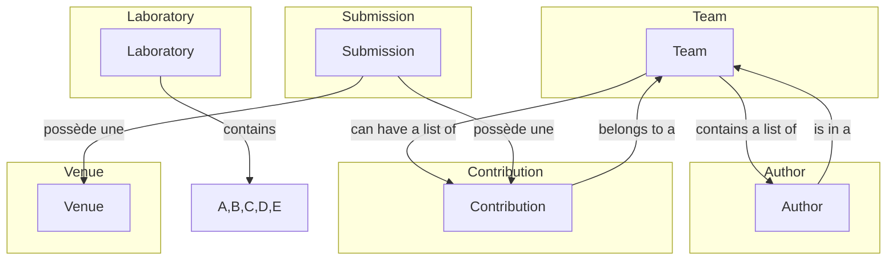

# Mon projet API REST

15/12/2023
Teo Villet

### Construit avec

Cette section répertorie les principaux frameworks/bibliothèques utilisés pour amorcer le projet. Les technologies suivantes ont été utilisées.

[![Node][Node.js]][Node-url]
[![Node][Express.js]][Express-url]

## Spécification du système 📄

Mon objectif était d'avoir un modèle de données d'un laboratoire (fictif), cela me permettrait de faire le cycle de vie des contributions d'un chercheur. Pour cela mon modèle de données contient 5 données principales :

**Contribution (Contribution):**
Une contribution est une entité principale qui représente une contribution scientifique au laboratoire.
Elle est associée à une équipe spécifique via l'attribut teamId.
Elle peut également être liée à plusieurs auteurs, identifiables par leurs identifiants d'auteur (Author).

**Équipe (Team):**
Une équipe représente un groupe de chercheurs travaillant ensemble au sein du laboratoire.
Elle est associée à plusieurs contributions via l'attribut contributions.
Elle peut inclure plusieurs auteurs identifiés par leurs identifiants d'auteur (Author).

**Auteur (Author):**
Un auteur représente un individu participant à une contribution scientifique.
Il est lié à une équipe spécifique via l'attribut teamId.
Il peut être associé à plusieurs contributions en fonction de son implication dans différentes contributions.

**Soumission (Submission):**
Une soumission représente la proposition d'une contribution pour publication.
Elle est liée à une contribution spécifique (Contribution) via l'attribut contributionId.
Elle peut également être associée à une venue spécifique (Venue) où la contribution pourrait être présentée.

**Venue (Venue):**
Une venue représente l'endroit où une contribution scientifique pourrait être présentée ou publiée.
Elle peut être associée à plusieurs soumissions (Submission).

Cette approche permet de suivre le cycle de vie complet d'une contribution, depuis sa création au sein d'une équipe jusqu'à sa soumission à une venue potentielle. Les relations entre ces entités permettent de naviguer à travers les différentes informations liées aux contributions scientifiques au sein du laboratoire.

Ci-dessous un graphique réprésentatif:



## Comment lancer le serveur 🚀

Avant tout placez bien dans le fichier racine contenant server.js
Pour lancer le serveur, rien de plus simple il vous suffit d'installer les packages à l'aide de la commande

```shell
$ npm i
```

Il vous suffit ensuite d'éxécuter le script que j'ai rédigé

```shell
$ npm run dev
```

Le serveur devrait maintenant être lancé sur le port **3000** (un petit message vous le diras normalement 😉)

## Mon jeu de données 🎮

#### AUTHORS

| id  | name     | grade   | teamId |
| --- | -------- | ------- | ------ |
| 1   | Auteur 1 | Grade A | 1      |
| 2   | Auteur 2 | Grade B | 2      |
| 3   | Auteur 3 | Grade C | 3      |

#### TEAMS

| id  | name   | description               | location       | contributions | authors |
| --- | ------ | ------------------------- | -------------- | ------------- | ------- |
| 1   | Team A | Une équipe formidable     | Localisation A |               | [1, 2]  |
| 2   | Team B | Une équipe exceptionnelle | Localisation B | [1, 2]        | [2, 3]  |
| 3   | Team C | Une équipe incroyable     | Localisation C | [2]           | [1, 3]  |

#### CONTRIBUTIONS

| id  | title          | startDate  | abstract                         | teamId |
| --- | -------------- | ---------- | -------------------------------- | ------ |
| 1   | Contribution A | 2023-01-01 | Description de la contribution A | 1      |
| 2   | Contribution B | 2023-02-01 | Description de la contribution B | 2      |
| 3   | Contribution C | 2023-03-01 | Description de la contribution C | 3      |

#### SUBMISSIONS

| id  | title        | abstract                       | submissionDate | materialCost | venueId | contributionId |
| --- | ------------ | ------------------------------ | -------------- | ------------ | ------- | -------------- |
| 1   | Soumission A | Description de la soumission A | 2023-01-01     | 1000         | 1       | 1              |
| 2   | Soumission B | Description de la soumission B | 2023-02-01     | 1500         | 2       | 2              |
| 3   | Soumission C | Description de la soumission C | 2023-03-01     | 1200         | 3       | 3              |

#### VENUES

| id  | name    | rank   |
| --- | ------- | ------ |
| 1   | Venue A | Rank A |
| 2   | Venue B | Rank B |
| 3   | Venue C | Rank C |

Le point d'entrées de mes données est le laboratoire, il contient tout mon modèle de données.

## Méthodologie suivie

Pour ce qui est de la méthodologie suivie, j'ai préféré commencer par coder le serveur et faire en dernier ma spécification oepnAPI.

Je trouve l'approche **"code d'abord"** permet souvent une progression plus rapide dans le développement. En début de projet, il peut être plus instinctif pour un développeur de commencer à traduire les idées en code fonctionnel plutôt que de se plonger dans la formalisation détaillée de la spécification. Cela offre la possibilité d'itérer rapidement sur les fonctionnalités et de visualiser concrètement l'évolution du projet.

Je me suis aussi rendu compte de problème dans mon modèle de données pendant que je développais le serveur, ce qui m'a fait changé seulement un peu de code alors que si j'avais commencé par la spécification, j'aurais probablement du la changer aussi pendant le développement.

Pour donner mon point de vue personnel, je ne pense pas refaire du swagger dans le cas ou je me dois de faire un serveur nodeJS, je voulais donc être capable d'en faire un de moi même sans m'aider d'une génération de code.
